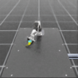
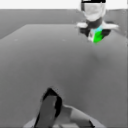
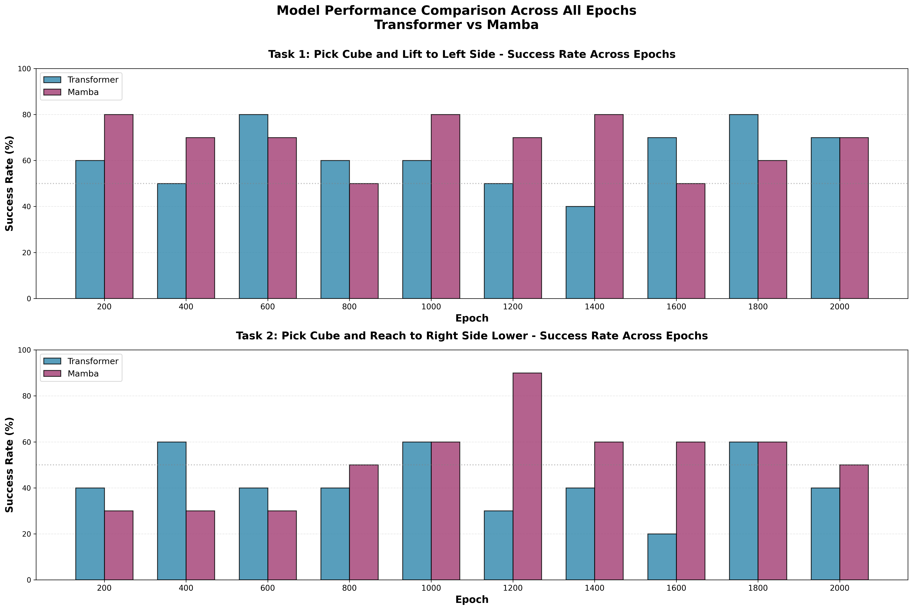
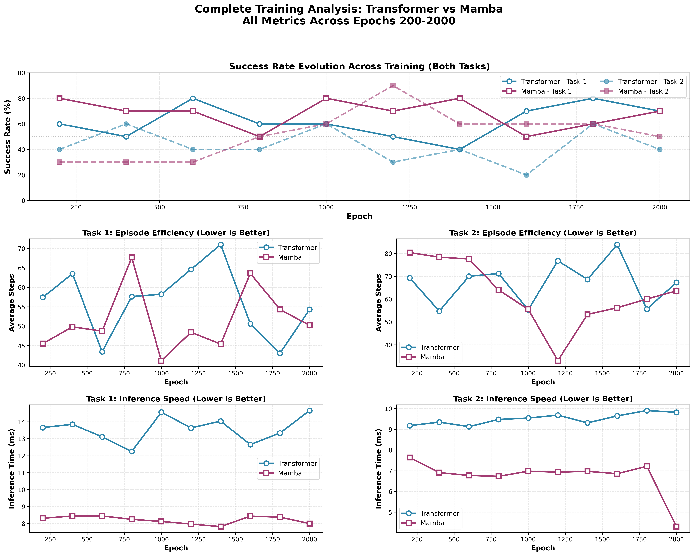

```{r setup, include=FALSE}
.libPaths(c('~/R/library', .libPaths()))
```

# Introduction

This report presents OpenARM-VLA, a Vision-Language-Action learning framework developed for robotic manipulation using the OpenArm platform in NVIDIA Isaac Sim, I evaluate the OpenARM-VLA framework using both MambaVLA and MDT Transformer architectures. My primary objective is to systematically compare state space and transformer-based policies on a cube lifting task involving directional motion commands. To achieve this, I construct a synthetic data generation pipeline with a reinforcement learning teacher policy to produce large-scale demonstration trajectories. This setup allows for fair benchmarking across architectures under identical perception, control, and simulation conditions. Experimental results demonstrate reliable task completion, establishing a foundation for scalable imitation learning and future foundation model training for robotic manipulation.

## Pipeline Overview

``` text
    ┌───────────────────────────────────────────────────────────────┐
    │                                                               │
    │        OpenARM Cube Lifting Task Environment (Isaac Sim)      |
    |                                                               |
    │   • Created Cameras for the observations                      |
    |                                                               |
    |   • Multi-direction lifting commands                          |
    |   • RGB camera observations                                   |
    |   • Randomized cube poses                                     |
    |                                                               |
    └───────────────────────────────────────────────────────────────┘
    ┌───────────────────────────────────────────────────────────────┐
    │                 Rollout Trajectory Collection                 │
    │                                                               │
    │  { Images | Robot States | Language Commands | Actions }      │
    │                                                               │
    └───────────────────────────────┬───────────────────────────────┘
                                    │
                                    ▼
                        ┌──────────────────────────┐
                        │   Episode Evaluation     │
                        │──────────────────────────│
                        │  SUCCESS  →  Save Demo   │
                        │  FAILURE  →  Discard     │
                        └─────────────┬────────────┘
                                      │
                                      ▼
    ┌───────────────────────────────────────────────────────────────┐
    │                  Demonstration Dataset Store                  │
    │                                                               │
    │  • Large scale trajectories                                   │
    │  • Balanced directions                                        │
    │  • Train / Val / Test splits                                  │
    │                                                               │
    └───────────────────────────────┬───────────────────────────────┘
                                    │
                                    ▼
    ┌───────────────────────────────────────────────────────────────┐
    │                     Imitation Learning via Flow Matching      │
    │                         Diffusion Policy Training             │
    │                                                               │
    │   Conditioning:                                               │
    │     • Visual Tokens                                           │
    │     • Language Tokens                                         │
    │     • Robot State                                             │
    │                                                               │
    │   Backbone Networks:                                          │
    │     ┌──────────────────────┐        ┌────────────────────────┐│
    │     │        MambaVLA      │        │    Transformer Model   ││
    │     │  (State Space Model) │        │ (Attention Based Model)││
    │     └─────────────┬────────┘        └─────────────┬──────────┘│
    │                   │                               │           │
    │                   └───────────────┬───────────────┘           │
    │                                   ▼                           │
    │                         Action Trajectory Predictor           │
    │                      (Joint Targets + Gripper Cmd)            │
    └───────────────────────────────┬───────────────────────────────┘
                                    │
                                    ▼
    ┌───────────────────────────────────────────────────────────────┐
    │                    Policy Evaluation in Simulation            │
    │                                                               │
    │        OpenARM Cube Lifting Task Environment (Isaac Sim)      │
    │                                                               │
    │  • Success Rate                                               │
    │  • Completion Time                                            │
    │  • Failure Modes                                              │
    │                                                               │
    └───────────────────────────────────────────────────────────────┘
```

# Simulation Environment

I used the OpenArm already available Env `Isaac-Lift-Cube-OpenArm-v0` for the simulation.

But as the default RL env doesnt have the cameras, I created cameras for the `Isaac-Lift-Cube-OpenArm-Play-v0` env.

I created three cameras:

-   `camera_link0`: This is the camera attached to the link0 of the robot.
-   `camera_fixed`: This is the camera attached to the fixed frame of the robot.
-   `main_camera`: This is used to record videos of the robot performing the task.

## Dataset Camera Views

```{=html}
<div style="display: flex; gap: 15px; flex-wrap: wrap; align-items: flex-start;">
  <div style="width:15%; display:flex; flex-direction:column; align-items:center;">
    
    <span style="margin-top:12px; font-size:1em; color:#444;">camera_link0</span>
  </div>
  <div style="width:15%; display:flex; flex-direction:column; align-items:center;">
    
    <span style="margin-top:12px; font-size:1em; color:#444;">camera_fixed</span>
  </div>
</div>
```

This the code that i added for `OpenARM-VLA/openarm_isaac_lab/source/openarm/openarm/tasks/manager_based/openarm_manipulation/unimanual/lift/lift_env_cfg.py` file to add the cameras:

``` python
    camera_link0: TiledCameraCfg = TiledCameraCfg(
        prim_path="{ENV_REGEX_NS}/Robot/openarm_link0/CameraLink0",
        offset=TiledCameraCfg.OffsetCfg(
            pos=(0.0, 0.0, 0.2),
            rot=(-0.29884, 0.64086, -0.64086, 0.29884),
        ),
        data_types=["rgb"],
        spawn=sim_utils.PinholeCameraCfg(
            focal_length=12.0,
            focus_distance=400.0,
            horizontal_aperture=20.955,
            clipping_range=(0.1, 20.0),
        ),
        width=128,
        height=128,
    )
```

# Dataset & Demonstrations

I collected 100 demonstration for each task that is metnioned in the `conf/tasks.yaml` file.

-   Dataset can be generated using the `src/generate_dataset.py` script.
-   The script collects the demonstration dataset for each task mentioned in the `conf/tasks.yaml` file.

If the task is successful, the script will save the demonstration dataset in the `data/demo_<id>/` directory. Otherwise, the script will skip the demonstration.

``` yaml
tasks:
  task0:
    name: pick_the_cube_and_lift_it_to_the_middle_of_the_table
    target_pose: "0.25,0.0,0.25"
  task1:
    name: pick_the_cube_and_reach_to_the_right_side_but_slighlty_lower
    target_pose: "0.25,-0.20,0.20"
```

Each demo is stored under: `data/demo_<id>/`

``` python
data/demo_<id>/
  actions        (T, 8)      float32
  dones          (T,)        int64
  rewards        (T,)        float32
  robot_states   (T, 9)      float32
  obs/
    agentview_rgb    (T, 128, 128, 3)  uint8
    eye_in_hand_rgb  (T, 128, 128, 3)  uint8
    joint_states     (T, 6)            float32
    gripper_states   (T, 2)            float32
```

-   The dataset is sotred in the form of `hdf5` files.

```{=html}
<div style="display:flex; gap:16px; flex-wrap:wrap;">
  <div style="width:49%;">
    <video controls width="100%">
      <source src="videos/middle_table_all_demos.mp4" type="video/mp4">
    </video>
    <div style="text-align:center;">Lift to middle</div>
  </div>

  <div style="width:49%;">
    <video controls width="100%">
      <source src="videos/right_lower_all_demos.mp4" type="video/mp4">
    </video>
    <div style="text-align:center;">Right-side lower</div>
  </div>
</div>
```

# Training the Model

Model can be trained using the `scripts/train_model.sh` script.

-   Both `mamba` and `transformer` models can be trained using the `scripts/train_model.sh` script.
-   The config file is `conf/config.yaml` file contains the training parameters and the dataset creation parameters
-   I trained the model for 500 epochs and saved the model in the `outputs/train/mamba/` and `outputs/train/transformer/` directories.
-   eval videos are stored in the `outputs/eval/mamba/` and `outputs/eval/transformer/` directories.

To embed the images i used the resnets from the `MambaVLA/backbones/resnet/resnet_img_encoder.py` file.

``` python
obs_encoder = MultiImageResNetEncoder(
    camera_names=["agentview", "eye_in_hand"],
    latent_dim=256,
    input_channels=3,
)
```

And for the language encoder i used the clip model from the `MambaVLA/backbones/clip/clip_lang_encoder.py` file.

``` python
language_encoder = LangClip(
    freeze_backbone=True,
    model_name="ViT-B/32",
)
```

So my model contains the following parameters

-   Total number of parameters: 177,773,96M
-   Trainable parameters: 26,496,648
-   Frozen parameters: 151,277,312

Almost both Mamba and Transformer contains almost similar number of parameters.

``` python
model_mamba = create_mambavla_model(
    dataloader=None,
    camera_names=["agentview", "eye_in_hand"],
    layers=5,
    latent_dim=256,
    action_dim=8,
    lang_emb_dim=512,
    embed_dim=256,
    obs_tok_len=2,
    action_seq_len=5,
    model_type="mamba",
)
```

``` python
    transformer_cfg={
        "n_heads": 8,
        "attn_pdrop": 0.1,
        "resid_pdrop": 0.1,
        "mlp_pdrop": 0.0,
        "bias": False,
        "use_rot_embed": False,
        "rotary_xpos": False,
    },
)
```

# Evaluation Metrics

I evaluated the models on the following metrics:

-   Success Rate
-   Inference Time
-   Average Episode Steps
-   Average Inference Time
-   Training Time
-   Computation Cost

## Success Rate

As i mentiond in the above sections that i collected 100 demonstrations for each task

tasks are basically `pick_the_cube_and_lift_it_to_the_middle_of_the_table` and `pick_the_cube_and_reach_to_the_right_side_but_slighlty_lower`

so it find that the task is successfully completed i basically check the error between the target pose and the current pose of the cube.

I gave some threshold for the error and if the error is less than the threshold then i consider the task as **successful** otherwise i consider the task as **failed**.

# Results

------------------------------------------------------------------------

## Detailed Performance Table

| Epoch | Task 1 Success Rate |   | Task 2 Success Rate |   | Task 1 Avg Steps |   | Task 2 Avg Steps |   |
|--------|--------|--------|--------|--------|--------|--------|--------|--------|
|  | **Transformer** | **Mamba** | **Transformer** | **Mamba** | **Transformer** | **Mamba** | **Transformer** | **Mamba** |
| 200 | 60% | **80%** ⭐ | **40%** | 30% | 57.4 | **45.5** ⭐ | **69.3** ⭐ | 80.4 |
| 400 | 50% | **70%** ⭐ | **60%** ⭐ | 30% | 63.5 | **49.8** ⭐ | **54.7** ⭐ | 78.4 |
| 600 | **80%** ⭐ | 70% | **40%** ⭐ | 30% | **43.4** ⭐ | 48.7 | **70.0** ⭐ | 77.6 |
| 800 | **60%** ⭐ | 50% | 40% | **50%** ⭐ | **57.6** ⭐ | 67.7 | 71.2 | **64.0** ⭐ |
| 1000 | 60% | **80%** ⭐ | **60%** | **60%** | 58.2 | **41.1** ⭐ | **55.3** ⭐ | 55.5 |
| 1200 | 50% | **70%** ⭐ | 30% | **90%** ⭐ | 64.6 | **48.4** ⭐ | 76.8 | **33.0** ⭐ |
| 1400 | 40% | **80%** ⭐ | 40% | **60%** ⭐ | 71.0 | **45.4** ⭐ | 68.6 | **53.3** ⭐ |
| 1600 | **70%** ⭐ | 50% | 20% | **60%** ⭐ | **50.6** ⭐ | 63.6 | 83.9 | **56.2** ⭐ |
| 1800 | **80%** ⭐ | 60% | **60%** ⭐ | **60%** | **43.0** ⭐ | 54.3 | **55.6** ⭐ | 60.0 |
| 2000 | **70%** | **70%** | 40% | **50%** ⭐ | **54.3** ⭐ | 50.2 | **67.3** ⭐ | 63.6 |

------------------------------------------------------------------------

```{=html}
<div style="display: flex; justify-content: center; margin-bottom: 18px;">
  
</div>
```

*Figure: Success rate across epochs for both models on both tasks. Mamba outperforms Transformer, especially on Task 2 ("Reach Right").*

```{=html}
<div style="display: flex; justify-content: center; margin-bottom: 18px;">
  
</div>
```

## Executive Summary

Comprehensive analysis of 10 training checkpoints reveals that **Mamba consistently outperforms Transformer** across both tasks with higher average success rates: - **Task 1 (Lift Left):** Mamba 68.0% vs Transformer 62.0% (+6%) - **Task 2 (Reach Right):** Mamba 52.0% vs Transformer 43.0% (+9%)

**Best Performance:** Mamba achieves **90% success rate** on Task 2 at epoch 1200, the highest performance recorded across all evaluations.

### Success Rate Statistics

| Metric            | Transformer | Mamba | Winner              |
|-------------------|-------------|-------|---------------------|
| **Task 1 - Mean** | 62.0%       | 68.0% | **Mamba (+6%)** ⭐  |
| **Task 1 - Max**  | 80%         | 80%   | **TIE**             |
| **Task 1 - Min**  | 40%         | 50%   | **Mamba** ⭐        |
| **Task 2 - Mean** | 43.0%       | 52.0% | **Mamba (+9%)** ⭐  |
| **Task 2 - Max**  | 60%         | 90%   | **Mamba (+30%)** ⭐ |
| **Task 2 - Min**  | 20%         | 30%   | **Mamba** ⭐        |

## Learning Trajectory

### Task 1 Learning Pattern

Both models show relatively stable performance throughout training with periodic peaks and valleys. No clear upward or downward trend, suggesting both models learned this task early and maintained capability.

### Task 2 Learning Pattern

**Mamba** shows clear learning progression: - Early training (200-600): 30% baseline - Mid training (800-1200): Breakthrough to 50-90% - Late training (1400-2000): Stabilizes at 50-60%

**Transformer** shows more erratic pattern: - Alternates between 20-60% throughout training - No clear improvement trajectory - Suggests Task 2 is at the edge of Transformer's capability

------------------------------------------------------------------------

# Rollouts

```{=html}
<div class="rollout-grid" style="display:grid;grid-template-columns:repeat(2,1fr);gap:16px;align-items:start;">
  <div>
    <strong>Lift to left side (1)</strong>
    <video controls width="100%" style="border-radius:8px;">
      <source src="videos/rollouts/lift-to-left-side-1.mp4" type="video/mp4">
      Your browser does not support the video tag.
    </video>
  </div>
  <div>
    <strong>Lift to left side (2)</strong>
    <video controls width="100%" style="border-radius:8px;">
      <source src="videos/rollouts/lift-to-left-side-2.mp4" type="video/mp4">
      Your browser does not support the video tag.
    </video>
  </div>
  <div>
    <strong>Reach to right (1)</strong>
    <video controls width="100%" style="border-radius:8px;">
      <source src="videos/rollouts/reach-to-right-1.mp4" type="video/mp4">
      Your browser does not support the video tag.
    </video>
  </div>
  <div>
    <strong>Reach to right (2)</strong>
    <video controls width="100%" style="border-radius:8px;">
      <source src="videos/rollouts/reach-to-right-2.mp4" type="video/mp4">
      Your browser does not support the video tag.
    </video>
  </div>
</div>
```

# Failures Faced and How I Solved Them

This section summarizes the main problems I encountered during environment setup, data collection, and model training, along with the fixes.

## 1) Multi-cube scene caused floating cubes

**Issue:** When I spawned 3 cubes and shifted their colors to select a target cube, some cubes spawned in mid‑air and caused collisions or unstable physics.\
**Fix:** I reduced the scene to a single cube for the lifting policy and fixed the target pose for that cube. This kept the scene stable and matched the policy assumptions.

```{=html}
<div style="margin-top: 8px;">
  <video width="640" height="360" controls>
    <source src="videos/extra_frames.mov" type="video/quicktime">
    Your browser does not support the video tag.
  </video>
  <p>
    So as you can observe in the video, when the episode changes and the cube is placed in a different
    position, extra frames get recorded. These frames are stored in the dataset, which is a problem
    because the model trains on noisy frames and struggles to learn the task.
  </p>
  <p>
    To solve this, I added a short settling phase at the beginning of each episode. I publish zero
    actions for a few steps, let the robot and physics settle, and only then start recording the dataset.
  </p>
  <p>
    This issue happens because Isaac Sim needs time to stabilize the physics after the cube is moved,
    which produces transient frames.
  </p>
  <p>
    A cleaner fix is to use the built-in `DexCube`, but because I needed different cube colors, I kept
    the custom cube and constrained the task to simple target directions.
  </p>
</div>
```

## 2) Camera orientation mismatch

**Issue:** The cameras initially produced incorrect viewpoints because the quaternion order/axis convention was wrong.\
**Fix:** I converted the orientation from `w, x, y, z` to the correct convention for Isaac Sim (`-x, w, z, -y`) and verified the view. I also tuned focal length (e.g., 12) for clear observations.

## 3) Dataset contamination and failed rollouts

**Issue:** Some episodes failed because the cube placement was too fast, and early frames contained visuals from the previous episode.\
**Fix:** I added warm‑up steps at the start of each rollout and skipped failed episodes (no save if success conditions were not met). This improved dataset quality.

## 4) Mamba + IsaacLab environment conflicts

**Issue:** `mamba-ssm` initially failed to build under Python 3.11 (required by Isaac Sim 5.1.0), and CUDA kernels were incompatible with the RTX PRO 6000 (sm_120).\
**Fix:** I installed `mamba-ssm` from source and upgraded to a PyTorch build that supports newer CUDA architectures:

``` python
Traceback (most recent call last):
  File "/home/navaneet/Documents/openarm/MambaVLA/run.py", line 179, in <module>
    main(args.benchmark_type, args.checkpoint_path)
  File "/home/navaneet/Documents/openarm/MambaVLA/run.py", line 109, in main
    model = create_model(cfg)
            ^^^^^^^^^^^^^^^^^
  File "/home/navaneet/Documents/openarm/MambaVLA/configs/factory.py", line 93, in create_model
    encoder = instantiate_from_config(model_config.model.backbones.encoder)
              ^^^^^^^^^^^^^^^^^^^^^^^^^^^^^^^^^^^^^^^^^^^^^^^^^^^^^^^^^^^^^
  File "/home/navaneet/Documents/openarm/MambaVLA/configs/factory.py", line 23, in instantiate_from_config
    target_class = _get_class_from_target(config._target_)
                   ^^^^^^^^^^^^^^^^^^^^^^^^^^^^^^^^^^^^^^^
  File "/home/navaneet/Documents/openarm/MambaVLA/configs/factory.py", line 67, in _get_class_from_target
    from MambaVLA import MambaModel
  File "/home/navaneet/Documents/openarm/MambaVLA/MambaVLA/__init__.py", line 11, in <module>
    from .mamba.mamba import MixerModel as MambaModel
  File "/home/navaneet/Documents/openarm/MambaVLA/MambaVLA/mamba/mamba.py", line 14, in <module>
    from mamba_ssm.models.config_mamba import MambaConfig
  File "/home/navaneet/miniconda3/envs/lab/lib/python3.11/site-packages/mamba_ssm/__init__.py", line 3, in <module>
    from mamba_ssm.ops.selective_scan_interface import selective_scan_fn, mamba_inner_fn
  File "/home/navaneet/miniconda3/envs/lab/lib/python3.11/site-packages/mamba_ssm/ops/selective_scan_interface.py", line 20, in <module>
    import selective_scan_cuda
ImportError: /home/navaneet/miniconda3/envs/lab/lib/python3.11/site-packages/selective_scan_cuda.cpython-311-x86_64-linux-gnu.so: undefined symbol: _ZN3c104cuda29c10_cuda_check_implementationEiPKcS2_jb
```

``` bash
pip install --no-cache-dir --no-binary :all: --no-build-isolation "mamba-ssm[causal-conv1d]"
pip install --pre torch torchvision torchaudio --index-url https://download.pytorch.org/whl/nightly/cu128
pip install mamba-ssm --no-build-isolation
```

## 5) Task-policy mismatch

**Issue:** I initially added two cubes but the teacher policy was trained for a single cube, so the policy moved to incorrect targets.\
**Fix:** I constrained the environment to a single cube and fixed the command to a consistent target pose (e.g., middle position), which aligned with the trained policy.

## 6) Environment setup steps

**Steps taken to stabilize the project setup:** - Created a new environment config and registered it in the task init.\
- Added cameras for data collection.\
- Disabled visualization markers to avoid distraction in RGB frames.\
- Verified task registration and command targets before rollout.

As My main goal is to train the model with both the transformer and the mamba architecture and compare the results.

So i chose with the simple task with single cube and for each task i gave a direction like `lift_it_to_the_middle_of_the_table` or `reach_to_the_right_side_but_slighlty_lower`

So i can easily compare the results of the transformer and the mamba architecture.
