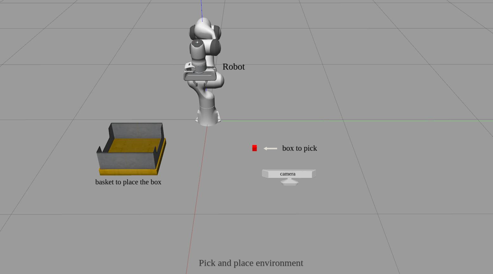

### What are Action Chunk Transformers?​
Action Chunk Transformers are a sophisticated integration of transformer-based models in robotics. Transformers, originally designed for natural language processing, have shown remarkable success in handling sequential data and making contextual decisions. By adapting this technology, we can teach robots to break down complex tasks into manageable "chunks" or segments of actions, allowing for more nuanced and adaptable behaviors.

### Environment

