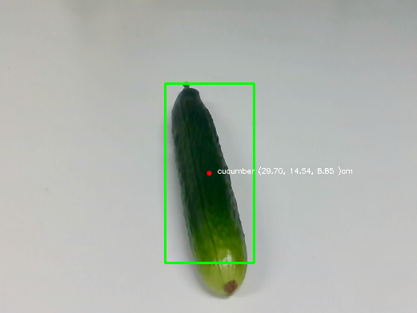

Cucumber harvesting using Object Detecion
================

The development of a cucumber harvesting
system that utilizes custom object detection with `YOLOv11`. After
detecting cucumbers, we generate specific actions for two types of
robots: the `ViperX 300s` arm robot and an `Automated Guided Vehicle`
(AGV) robot.

The primary aim of this project is to create a comprehensive `dataset`
that captures both the actions performed by the robots and the images
taken during the harvesting process. This dataset is a crucial resource
for developing and refining algorithms that will enhance future robotic
harvesting techniques.

By systematically recording a wide array of interactions and scenarios,
we not only improve the efficiency of current systems but also lay a
robust foundation for future advancements in agricultural robotics. This
initiative represents a significant step forward in automating and
optimizing the harvesting process through the integration of advanced
machine learning models and robotic technology.

## 🛠️ Prerequisites

- **Ubuntu 20.04** 🐧

- **Interbotix Packages** 🤖

- **Python** 🐍

- **ROS** 🤖

- **interbotix_ws : -**

## 🚀 Installation

To get started with this frame work, follow these steps:

``` bash
git clone https://github.com/sainavaneet/Harvesting.git

cd Harvesting/

pip install -e .
```

## 🗂 Project Structure

``` bash
├── base_control
│   ├── agv_control.py
│   ├── examples
│   │   ├── move_6s_back.py
│   │   ├── move_6s_forward.py
│   │   ├── move_base.py
│   │   ├── odom_cal.py
│   │   └── original.py
│   ├── gui_control.py
│   └── __pycache__
│       └── agv_control.cpython-38.pyc
├── config
│   └── vx300s.yaml
├── harvest.py
├── images
│   └── obj_detection.png
├── index.md
├── __init__.py
├── launch
│   └── robot.launch
├── object_detection
│   ├── dataset
│   │   └── Cucumber.v2i.yolov11.zip
│   ├── detection_realsenes.py
│   └── weights
│       ├── best.pt
│       └── last.pt
├── __pycache__
│   └── var.cpython-38.pyc
├── README.md
├── requirements.txt
├── robot_utils.py
├── rviz
│   ├── puppet_left.rviz
│   └── rviz.rviz
├── setup.py
├── sleep.py
├── transform_co.py
├── utilities.py
├── var.py
└── videos
    ├── 1.mp4
    ├── 2.mp4
    ├── 3.mp4
    └── 4.mp4
```

## Launch

``` bash
source interbotix_ws/devel.setup.bash

cd ~/Harvesting/launch/

roslaunch robot.launch use_rviz:=false use_sim:=False # if you need in simulation use True
```

## Object Detection

The object detection files are located in the `/object_detection`
directory.

By executing the `detection_realsense.py` script, cucumbers can be
detected. We have designed the algorithm in such a way that it
determines a stable pose of the cucumber after detecting it, based on a
predefined threshold.



## 🦾TASK

- **`Robot Movement`**: The robot starts at position 1, moves along the
  path, detects cucumbers, and harvests them.

- **`Detection and Harvesting`**`:` After harvesting cucumbers at
  position 1, the robot moves to position 2, detects the next cucumber,
  and proceeds with harvesting. This pattern continues as the robot
  moves along the track.

- **`Sequential Harvesting`**`:` The robot moves sequentially from
  positions 1 to 4, harvesting cucumbers at each point along the way.

- **`Reversal of Process`**`:` Once the robot reaches the end of the
  track, at position 5, it reverses the process and moves back along the
  same path, harvesting cucumbers from position 6 to 3.

- **`Return to Start`**`:` After completing the harvesting task, the
  robot returns to its starting position at 9.


The entire task can be executed using the Python script.  

``` python
python harvest.py
```

## 🎁 Dataset

**`Dataset can be found in the releases.`**

## 🏋️ Results

