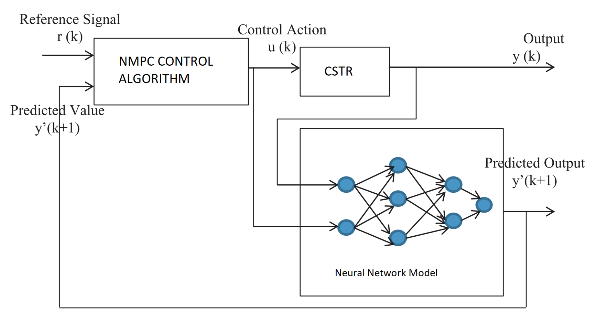
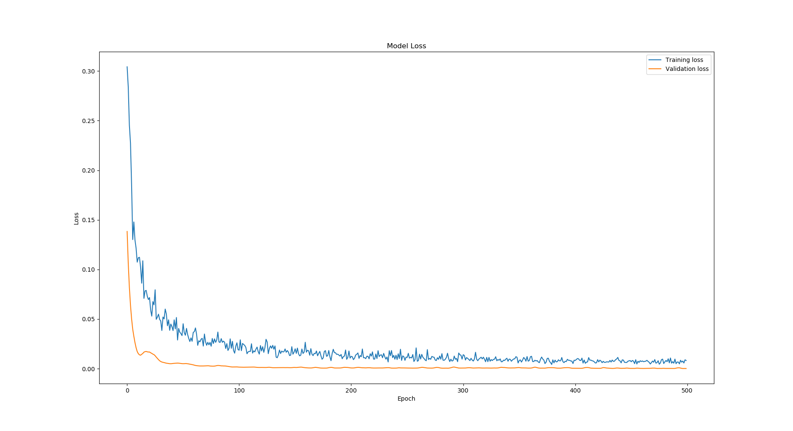

## Introduction

The Continuous Stirred Tank Reactor (CSTR) is a fundamental model in chemical engineering, representing a reactor where the contents are well-mixed, ensuring uniform composition and temperature throughout. This report delves into the mathematical modeling of a CSTR, its simulation, and control using a Nonlinear Model Predictive Control (NMPC) strategy integrated with a neural network for predictive behavior.

## CSTR Model

The CSTR dynamics are governed by the mass and energy balance equations, capturing the reaction kinetics, heat transfer, and fluid mixing. The model is described by the following differential equations:

$$
\frac{dC}{dt} = \frac{F}{V}(C_{in} - C) - k(T)C
$$

$$
\frac{dT}{dt} = \frac{F}{V}(T_{in} - T) + \frac{-\Delta H}{\rho C_p}k(T)C + \frac{Q}{\rho C_p V}
$$

where $C$ and $T$ denote the concentration and temperature in the reactor, $F$ the flow rate, $V$ the volume, $C_{in}$ and $T_{in}$ the inlet concentration and temperature, $k(T)$ the temperature-dependent reaction rate, $\Delta H$ the heat of reaction, $\rho$ the density, $C_p$ the heat capacity, and $Q$ the heat input or removal.

The rate of reaction for species A is described as:

$$
-r_A = k(T)C_A = k_0 e^{\left( \frac{-E}{RT} \right)}C_A
$$

where $C_A$ is the concentration of species A, $k(T)$ is the temperature-dependent reaction rate constant, $k_0$ is the pre-exponential factor or frequency factor, $E$ is the activation energy, $R$ is the universal gas constant, $T$ is the temperature, and $r_A$ is the reaction rate for species A.

## Parameters

| Parameter | Value |
|-----------|-------|
| Initial Flow Rate | $F_0 = 0.1 \text{ m}^3/\text{min}$ |
| Initial Temperature | $T_0 = 350.0 \text{ K}$ |
| Initial Concentration | $c_0 = 1.0 \text{ kmol/m}^3$ |
| Reactor Radius | $r = 0.219 \text{ m}$ |
| Reaction Rate Constant | $k_0 = 7.2 \times 10^{10} \text{ 1/min}$ |
| Activation Energy/Gas Constant | $E_b/R = 8750 \text{ K}$ |
| Overall Heat Transfer Coefficient | $U = 54.94 \text{ kJ}/(\text{min} \cdot \text{m}^2 \cdot \text{K})$ |
| Density | $\rho = 1000 \text{ kg/m}^3$ |
| Specific Heat Capacity | $C_p = 0.239 \text{ kJ}/(\text{kg} \cdot \text{K})$ |
| Heat of Reaction | $\Delta H = -5 \times 10^4 \text{ kJ/kmol}$ |
| Small Value (Avoid Division by Zero) | $\varepsilon = 1 \times 10^{-5} \text{ m}$ |
| Mass Fractions | $x_s = [0.878, 324.5, 0.659]$ |
| Input Parameters | $u_s = [300, 0.1]$ |

## Nonlinear Model Predictive Control Implementation

Nonlinear Model Predictive Control (NMPC) is a sophisticated control strategy used to manage complex dynamical systems. It involves optimizing control inputs over a defined prediction horizon, aiming to minimize deviations from desired setpoints while adhering to operational constraints. NMPC is particularly effective for systems with nonlinear dynamics, as it can account for these nonlinearities in both the system model and the control strategy.

In our implementation, NMPC is integrated with a neural network that predicts future system states. This integration enhances the controller's ability to handle complex, nonlinear system behaviors. The core of NMPC involves solving an optimization problem at each control step, formulated as follows:

### NMPC Parameters

- **Prediction Horizon and Time Step**:

  $$ N = 15, \quad dt = 0.25\;\text{seconds}, \quad Tf = 3.75\;\text{seconds} $$

- **Cost Function**:

  The overall objective of NMPC is defined by the cost function $ J $, a sum of the stage costs over the prediction horizon and a terminal cost at the end of the horizon. The cost function is given by:

  $$
  J = \sum_{k=t}^{t+N-1} L(x_k, u_k) + M(x_{t+N})
  $$

  where:

  - $ L(x_k, u_k) $ is the stage cost function at each time step $ k $.
  - $ M(x_{t+N}) $ is the terminal cost function at the end of the horizon.

  The stage cost $ L $ and terminal cost $ M $ are defined as:

  $$
  L(x_k, u_k) = (x_k - x_{\text{ref},k})^\top Q (x_k - x_{\text{ref},k}) + (u_k - u_{\text{ref},k})^\top R (u_k - u_{\text{ref},k})
  $$

  $$
  M(x_{t+N}) = (x_{t+N} - x_{\text{ref},t+N})^\top P (x_{t+N} - x_{\text{ref},t+N})
  $$

  The weight matrices $ Q, R, P $ are given by:

  $$
  Q = \text{diag}(1.0 / \textbf{xs}^2)
  $$

  $$
  R = \text{diag}(1.0 / \textbf{us}^2)
  $$

  $$
  P = \begin{bmatrix}
  5.92981953e-01 & -8.40033347e-04 & -1.54536980e-02 \\
  -8.40033347e-04 & 7.75225208e-06 & 2.30677411e-05 \\
  -1.54536980e-02 & 2.30677411e-05 & 2.59450075e00
  \end{bmatrix}
  $$

- **Control Constraints**:

  $$
  \textbf{umin} = \begin{bmatrix} 0.95 \\ 0.85 \end{bmatrix} \times \textbf{us}
  $$

  $$
  \textbf{umax} = \begin{bmatrix} 1.05 \\ 1.15 \end{bmatrix} \times \textbf{us}
  $$

### ACADOS OCP Solver Configuration

- **Solver Type**:
  - SQP (Sequential Quadratic Programming) or SQP-RTI (Real-Time Iteration).

- **Integrator Type**:
  - "IRK" (Implicit Runge-Kutta) for nonlinear MPC.

- **QP Solver and Condensing**:
  - "PARTIAL_CONDENSING_HPIPM", with condensing intervals equal to $ N $.

- **Regularization**:

  $$
  \text{Levenberg-Marquardt} = 1e-5
  $$

### ACADOS Integrator Configuration

- **Integrator Options**:
  - Type: "ERK" (Explicit Runge-Kutta).
  - Stages and Steps: 4 stages, 100 steps.
  - Sensitivity Propagation: Configurable.

This NMPC setup optimizes control actions over the specified prediction horizon, minimizing a quadratic cost function subject to dynamic constraints and control bounds. The ACADOS framework provides efficient solving capabilities for the nonlinear optimal control problem.

## Neural Network Integration in NMPC for CSTR

### Data Preparation
The foundation of a robust neural network model lies in the quality and quantity of the data used for training. In the case of a Continuous Stirred Tank Reactor (CSTR), data can be sourced from historical operational records, simulations, or experimental setups. Key variables such as reactant concentrations, temperature, inflow rates, and heat inputs are recorded. This dataset is then divided into features (inputs) and targets (outputs), which the neural network will learn to map. The input and output datasets obtained from the NMPC controller are used as the historical dataset for neural network training.

### Neural Network Architecture
The architecture of the neural network is designed to effectively capture the complex dynamics of the CSTR. A typical architecture includes:

- **Input Layer**: Accepts the current state of the CSTR, such as temperature, concentration, and control inputs. Mathematically, if the input vector is $ \mathbf{x} $, then the input layer can be represented as $ \mathbf{a}_0 = \mathbf{x} $.

- **Hidden Layers**: Multiple layers with a sufficient number of neurons to enable the network to learn complex patterns. If $ \mathbf{a}_{i-1} $ is the output of the previous layer, the output of the $ i $-th layer can be represented as:

  $$
  \mathbf{a}_i = \text{ReLU}(\mathbf{W}_i \mathbf{a}_{i-1} + \mathbf{b}_i)
  $$

  where $ \mathbf{W}_i $ and $ \mathbf{b}_i $ are the weights and biases of the $ i $-th layer, and ReLU (Rectified Linear Unit) introduces non-linearity.

- **Output Layer**: Predicts the future states of the CSTR, crucial for the NMPC controller. The output $ \mathbf{y} $ is expressed as:

  $$
  \mathbf{y} = \mathbf{W}_{\text{output}} \mathbf{a}_{\text{last}} + \mathbf{b}_{\text{output}}
  $$

  where $ \mathbf{a}_{\text{last}} $ is the output of the last hidden layer.

### Training Process
The training process involves several steps:

1. **Data Scaling**: Input ($ \mathbf{X} $) and output ($ \mathbf{Y} $) data are scaled to improve training efficiency and stability. Standardization is expressed as:

  $$
  \mathbf{X}_{\text{scaled}} = \frac{\mathbf{X} - \mu_{\mathbf{X}}}{\sigma_{\mathbf{X}}}
  $$

  where $ \mu_{\mathbf{X}} $ and $ \sigma_{\mathbf{X}} $ are the mean and standard deviation of the input data, respectively.

2. **Loss Function**: Mean Squared Error (MSE) quantifies the difference between network predictions ($ \mathbf{\hat{Y}} $) and actual data ($ \mathbf{Y} $):

  $$
  \text{MSE} = \frac{1}{n} \sum_{i=1}^{n} (\mathbf{\hat{Y}}_i - \mathbf{Y}_i)^2
  $$

  where $ n $ is the number of data points.

3. **Optimizer**: Algorithms like Adam or SGD (Stochastic Gradient Descent) adjust the network weights to minimize the loss function. The weight update can be expressed as:

  $$
  \mathbf{W}_{\text{new}} = \mathbf{W}_{\text{old}} - \alpha \nabla \text{MSE}
  $$

  where $ \alpha $ is the learning rate, and $ \nabla \text{MSE} $ is the gradient of the MSE.

4. **Validation**: A portion of the dataset not used in training validates the model’s performance and prevents overfitting.

## Results

## Conclusion
The CSTR model, integrated with a neural network and controlled via NMPC, represents a sophisticated approach to managing complex chemical reactions. This integration allows for efficient, real-time adjustments to reactor operating conditions, ensuring optimal performance under varying conditions.

