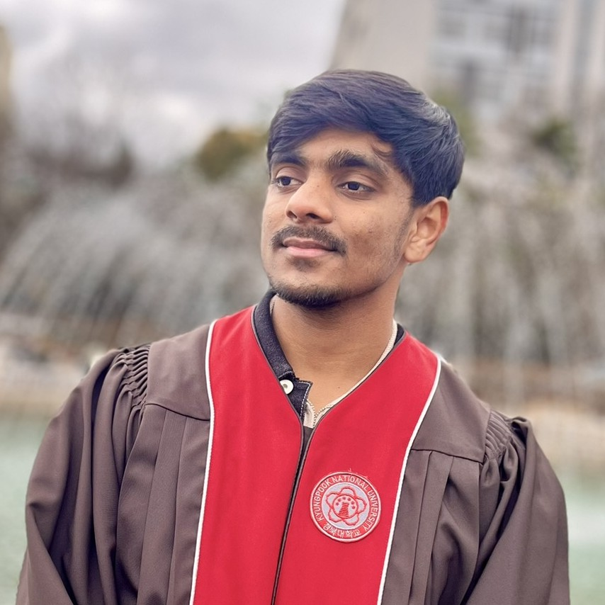

# Bio

  
   
  Sai Navaneet
   
  Master's in Electronics and Electrical Engineering

From the moment I discovered the excitement of engineering, I've been drawn to the transformative potential of automation and robotics. My journey began in 2022 as an Electronics and Electrical Engineering student in Korea, where I delved into the intricate realms of electronic and control systems. Building on this foundation, I am currently pursuing a Master's degree in Electronics, centering my research on advanced robotics systems.

Over the years, I've honed my skills in software development tailored specifically for robotics, finding tremendous satisfaction in turning complex ideas into practical, automated solutions. Whether I'm designing sophisticated mechatronic frameworks or crafting next-generation software, I'm driven by a passion to expand the horizons of what robotics can achieve. Through each endeavor, I strive to blend innovation and precision, forging new paths in the fast-evolving world of automation.

## Go2

    

        

            <video loop muted autoplay>
                <source src="_static/videos/go2/output.mp4" type="video/mp4">
            </video>
        

    

