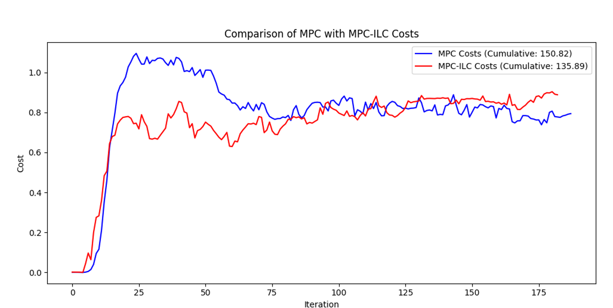
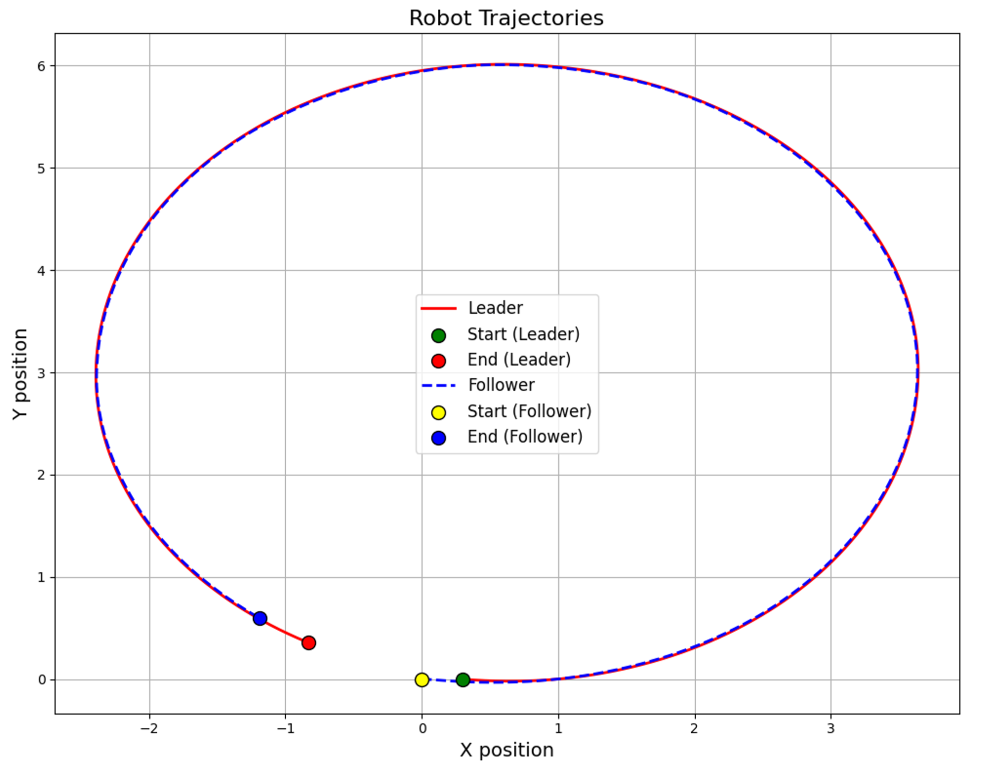

# Hybrid Model Predictive and Iterative Learning Control for Enhanced Leader-Follower Robotic Tracking

EERC paper


## Tested for "S" Trajectory

```{raw} html
<section class="section">
  <div class="container is-max-desktop">
    <div class="columns is-centered has-text-centered">
      <div class="column">
        <div style="position: relative; padding-bottom: 56.25%; height: 0; overflow: hidden; border-radius: 8px; box-shadow: 0 4px 8px rgba(0,0,0,0.1);">
          <iframe style="position: absolute; top: 0; left: 0; width: 100%; height: 100%;" src="https://www.youtube.com/embed/6Dyg_3ztMKw?autoplay=1&mute=1&controls=0&loop=1&playlist=6Dyg_3ztMKw&modestbranding=1&playsinline=1" frameborder="0" allow="autoplay; encrypted-media" allowfullscreen></iframe>
        </div>
      </div>
    </div>
  </div>
</section>
```

## Abstract

This paper introduces a novel hybrid control strategy combining Model Predictive Control (MPC) and Iterative Learning Control (ILC) to improve leader-follower tracking accuracy and robustness in mobile robots. MPC optimizes control inputs over a predictive horizon by minimizing a cost function, while ILC refines these inputs by learning from past errors.

## Mathematical Formulation

### System Dynamics

The state of the follower robot is:

```{math}
x_f = [x_f, y_f, \theta_f]^T
```

Control inputs:

```{math}
u = [v, \omega]^T
```

Discrete-time kinematic model:

```{math}
x_f(k + 1) = x_f(k) + \begin{bmatrix}
v(k) \cos(\theta_f(k)) T \\
v(k) \sin(\theta_f(k)) T \\
\omega(k) T
\end{bmatrix}
```

Where $T$ is the sampling time.

### MPC Cost Function

The MPC minimizes the following cost function over a finite horizon $N$:

```{math}
J = \sum_{k=0}^{N-1}\left[\omega_p\|P_f(k)-P_d(k)\|^2 + \omega_\theta(\theta_f(k)-\theta_d(k))^2 + \omega_u\|u(k)\|^2\right]
```

where:

- $P_f(k) = [x_f(k), y_f(k)]^T$: position of follower.
- $P_d(k), \theta_d(k)$: desired position and orientation.
- $\omega_p, \omega_\theta, \omega_u$: weights for position, orientation errors, and control effort.

### Desired Position Calculation

The desired position $P_d$ is calculated from the leader's state $x_l = [x_l, y_l, \theta_l]^T$ and specified distance $d$:

```{math}
P_d = \begin{bmatrix}
x_l - d\cos(\theta_l) \\
y_l - d\sin(\theta_l)
\end{bmatrix}
```

### Iterative Learning Control (ILC) Update

Error vector:

```{math}
e(k) = \begin{bmatrix}
x_f(k)-x_d(k) \\
y_f(k)-y_d(k) \\
\theta_f(k)-\theta_d(k)
\end{bmatrix}
```

ILC control update:

```{math}
u_{ILC}(k)=\nu_{MPC}(k)+L[e(k)-e(k-1)]
```

where:

- $\nu_{MPC}(k)$: optimal MPC control input.
- $L$: learning matrix.
- $e(k-1)$: error from previous iteration.

### Hybrid Integration

The hybrid method combines MPC and ILC:

1. Solve MPC optimization: $\nu_{MPC}=\arg\min J$  
2. ILC update: $\nu=\nu_{ILC}$  
3. Apply $\nu$ to follower robot  
4. Update follower and leader states

## Algorithm

```python
Algorithm 1: Hybrid MPC-ILC
Require: Initial states x_f, x_l; past error e_past=0, past input u_past=0
Require: T, N, ω_p, ω_θ, ω_u, d, L
While true:
  1. Obtain current leader state x_l(k)
  2. Compute desired P_d(k), θ_d(k)
  3. Solve MPC to get u_MPC
  4. Calculate tracking error e(k)
  5. Update control: u_ILC = u_past + L(e(k)-e_past)
  6. Apply u_ILC to follower
  7. Update u_past = u_MPC, e_past = e(k)
  8. Update robot states
End While
```

## Experimental Results

Experiments with TurtleBot 3 robots validated the hybrid MPC-ILC method, demonstrating significant improvements in position tracking accuracy, orientation accuracy, and balanced control efforts compared to standalone MPC and ILC.

- Leader velocity: $v=0.3\,\text{m/s}, \omega=0.3\,\text{rad/s}$
- MPC parameters: $N=20, T=0.2\,s, \omega_p=7, \omega_\theta=1, \omega_u=1$
- ILC learning matrix: $L = \mathrm{diag}([0.1, 0.1])$

```{raw} html
<div style="text-align: center; margin: 1rem 0;">
  
</div>
```

```{raw} html
<div style="text-align: center; margin: 1rem 0;">
  
</div>
```

## Conclusion

The hybrid MPC-ILC approach offers improved accuracy, robustness, and efficiency for leader-follower robotic tracking. Future work includes integrating with advanced control methods and testing in more complex scenarios.

- [Source Code](https://github.com/sainavaneet/MPC-ILC)

```{raw} html
<section class="section">
  <div class="container is-max-desktop">
    <div class="columns is-centered has-text-centered">
      <div class="column">
        <div style="display: flex; gap: 30px; justify-content: center; flex-wrap: wrap; margin-top: 20px; align-items: flex-start;">
          <div style="flex: 1; min-width: 200px; max-width: 28%;">
            <h2 class="title is-3" style="margin-bottom: 15px;">Hybrid MPC-ILC Demo</h2>
            <div style="position: relative; padding-bottom: 177.78%; height: 0; overflow: hidden; border-radius: 8px; box-shadow: 0 4px 8px rgba(0,0,0,0.1); background: #000;">
              <iframe style="position: absolute; top: 0; left: 0; width: 100%; height: 100%;" src="https://www.youtube.com/embed/CdYn9fnHEcE?autoplay=1&mute=1&controls=0&loop=1&playlist=CdYn9fnHEcE&modestbranding=1&playsinline=1" frameborder="0" allow="autoplay; encrypted-media" allowfullscreen></iframe>
            </div>
          </div>
        </div>
      </div>
    </div>
  </div>
</section>
```

---

## Comparison between MPC and LMPC and Obstacle Avoidance

We included a safe set process to keep the follower robot at a fixed distance from the leader robot, and then we added obstacle avoidance to the follower robot using LMPC.

```{raw} html
<section class="section">
  <div class="container is-max-desktop">
    <div class="columns is-centered has-text-centered">
      <div class="column">
        <h2 class="title is-3">LMPC with Obstacle Avoidance</h2>
        <div style="position: relative; padding-bottom: 56.25%; height: 0; overflow: hidden; border-radius: 8px; box-shadow: 0 4px 8px rgba(0,0,0,0.1); margin-top: 20px;">
          <iframe style="position: absolute; top: 0; left: 0; width: 100%; height: 100%;" src="https://www.youtube.com/embed/v308ep-aqd0?autoplay=1&mute=1&controls=0&loop=1&playlist=v308ep-aqd0&modestbranding=1&playsinline=1" frameborder="0" allow="autoplay; encrypted-media" allowfullscreen></iframe>
        </div>
      </div>
    </div>
  </div>
</section>
```

### Testing With MPC

```{raw} html
<div style="text-align: center; margin: 1rem 0;">
  
</div>
```

### Testing with LMPC

```{raw} html
<div style="display: flex; justify-content: center; gap: 1rem; margin: 1rem 0; flex-wrap: wrap;">
  
  
  
</div>
```


### Results

```{raw} html
<div style="text-align: center; margin: 1rem 0;">
  
</div>
```

